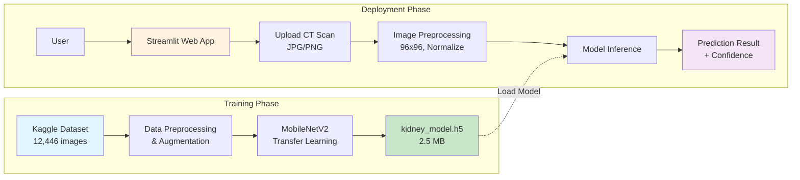
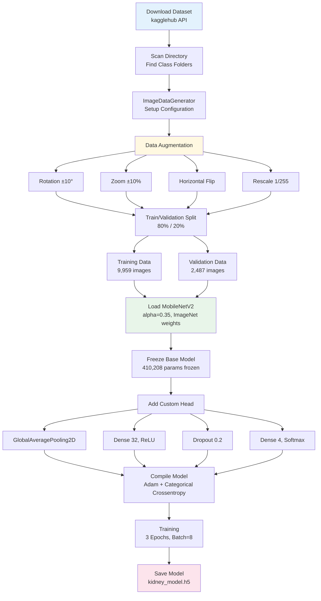
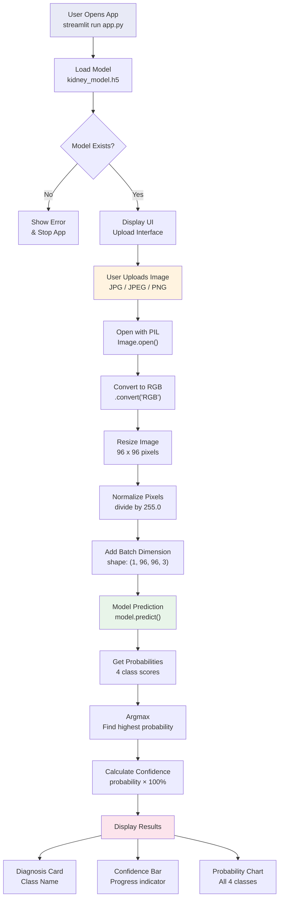
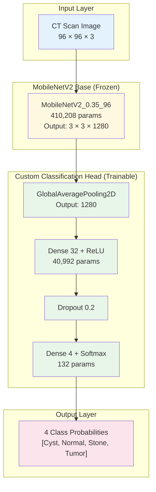
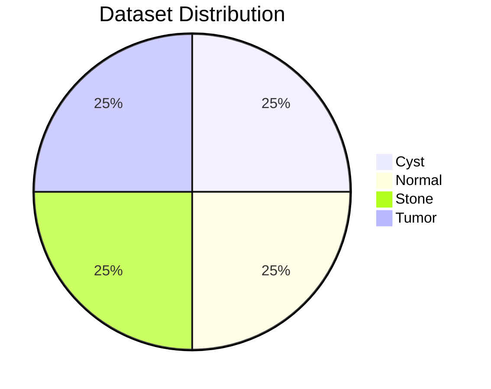

# Kidney CT Scan AI Classifier


Aplikasi klasifikasi CT Scan ginjal berbasis Deep Learning menggunakan arsitektur MobileNetV2 untuk mendeteksi 4 kondisi: **Cyst**, **Normal**, **Stone**, dan **Tumor**.

---

## Daftar Isi

- [Overview](#overview)
- [System Architecture](#system-architecture)
- [Training Pipeline](#training-pipeline)
- [Inference Pipeline](#inference-pipeline)
- [Model Architecture](#model-architecture)
- [Installation](#installation)
- [Usage](#usage)
- [Project Structure](#project-structure)
- [Dataset](#dataset)
- [Performance](#performance)
- [Technologies](#technologies)

---

## Overview

Proyek ini mengimplementasikan sistem AI untuk klasifikasi gambar CT Scan ginjal secara otomatis. Sistem ini dapat membantu dalam deteksi dini berbagai kondisi ginjal melalui analisis gambar medis.

### Klasifikasi 4 Kelas:

| Kelas | Deskripsi |
|-------|-----------|
| **Cyst** | Kantung berisi cairan pada ginjal |
| **Normal** | Kondisi ginjal sehat tanpa kelainan |
| **Stone** | Batu ginjal (nefrolitiasis) |
| **Tumor** | Pertumbuhan abnormal pada ginjal |

---

## System Architecture



### Penjelasan System Architecture:

| Komponen | Deskripsi |
|----------|-----------|
| **Kaggle Dataset** | Sumber data CT Scan ginjal dengan 12,446 gambar dari 4 kelas berbeda |
| **Data Preprocessing** | Normalisasi, resize, dan augmentasi data untuk meningkatkan generalisasi model |
| **MobileNetV2** | Arsitektur CNN ringan dengan transfer learning dari ImageNet |
| **kidney_model.h5** | Model terlatih dalam format HDF5, ukuran hanya 2.5 MB |
| **Streamlit Web App** | Antarmuka web interaktif untuk upload dan klasifikasi gambar |
| **Model Inference** | Proses prediksi menggunakan model yang sudah di-load |
| **Prediction Result** | Output berupa kelas prediksi beserta tingkat kepercayaan (confidence) |

---

## Training Pipeline



### Penjelasan Training Pipeline:

#### 1. Download Dataset
```python
path = kagglehub.dataset_download("nazmul0087/ct-kidney-dataset-normal-cyst-tumor-and-stone")
```
Dataset diunduh secara otomatis dari Kaggle menggunakan library `kagglehub`. Dataset berisi gambar CT Scan ginjal yang sudah dikategorikan ke dalam 4 folder sesuai kelasnya.

#### 2. Scan Directory
```python
for root, dirs, files in os.walk(path):
    if all(cls in dirs for cls in ["Cyst", "Normal", "Stone", "Tumor"]):
        DATASET_DIR = root
```
Sistem mencari direktori yang mengandung keempat folder kelas untuk memastikan path dataset yang benar.

#### 3. ImageDataGenerator Setup
```python
datagen = ImageDataGenerator(
    rescale=1/255.0,
    validation_split=0.2,
    rotation_range=10,
    zoom_range=0.1,
    horizontal_flip=True
)
```
Konfigurasi generator untuk memproses gambar secara batch tanpa memuat semua data ke RAM.

#### 4. Data Augmentation
| Teknik | Nilai | Tujuan |
|--------|-------|--------|
| **Rotation** | ±10° | Membuat model robust terhadap orientasi gambar |
| **Zoom** | ±10% | Variasi skala objek dalam gambar |
| **Horizontal Flip** | True | Meningkatkan variasi data training |
| **Rescale** | 1/255 | Normalisasi pixel ke range [0, 1] |

#### 5. Train/Validation Split
- **Training**: 9,959 gambar (80%)
- **Validation**: 2,487 gambar (20%)

#### 6. Load MobileNetV2
```python
base_model = MobileNetV2(
    input_shape=(96, 96, 3),
    include_top=False,
    weights="imagenet",
    alpha=0.35
)
```
- **alpha=0.35**: Versi ultra-ringan untuk efisiensi
- **weights="imagenet"**: Pre-trained weights untuk transfer learning
- **include_top=False**: Tanpa classification layer asli

#### 7. Freeze Base Model
```python
base_model.trainable = False
```
Membekukan 410,208 parameter base model agar tidak berubah selama training. Hanya custom head yang akan di-train.

#### 8. Custom Classification Head
| Layer | Output Shape | Parameters | Fungsi |
|-------|--------------|------------|--------|
| GlobalAveragePooling2D | (None, 1280) | 0 | Reduksi dimensi spasial |
| Dense (32, ReLU) | (None, 32) | 40,992 | Feature extraction |
| Dropout (0.2) | (None, 32) | 0 | Regularisasi |
| Dense (4, Softmax) | (None, 4) | 132 | Output 4 kelas |

#### 9. Compile Model
```python
model.compile(
    optimizer="adam",
    loss="categorical_crossentropy",
    metrics=["accuracy"]
)
```

#### 10. Training
- **Epochs**: 3 (lightweight training)
- **Batch Size**: 8 (memory efficient)
- **Optimizer**: Adam

#### 11. Save Model
```python
model.save("model/kidney_model.h5")
```
Model disimpan dalam format HDF5 dengan ukuran ~2.5 MB.

---

## Inference Pipeline



### Penjelasan Inference Pipeline:

#### 1. Load Model
```python
MODEL_PATH = "model/kidney_model.h5"
model = tf.keras.models.load_model(MODEL_PATH)
```
Model dimuat saat aplikasi pertama kali dijalankan. Jika file tidak ditemukan, aplikasi akan menampilkan error dan berhenti.

#### 2. User Upload Image
```python
uploaded_file = st.file_uploader("Upload CT Scan Image", type=["jpg", "jpeg", "png"])
```
User dapat mengupload gambar CT Scan dalam format JPG, JPEG, atau PNG.

#### 3. Open with PIL
```python
image = Image.open(uploaded_file)
```
Gambar dibuka menggunakan library PIL (Python Imaging Library).

#### 4. Convert to RGB
```python
image = image.convert("RGB")
```
Konversi ke mode RGB untuk memastikan gambar memiliki 3 channel warna, karena model dilatih dengan input RGB.

#### 5. Resize Image
```python
img = image.resize((96, 96))
```
Gambar di-resize ke 96×96 pixels sesuai dengan input size model.

#### 6. Normalize Pixels
```python
img = np.array(img) / 255.0
```
Nilai pixel dinormalisasi ke range [0, 1] dengan membagi 255.

#### 7. Add Batch Dimension
```python
img_array = np.expand_dims(img, axis=0)
# Shape: (1, 96, 96, 3)
```
Menambahkan dimensi batch karena model mengharapkan input dalam format batch.

#### 8. Model Prediction
```python
prediction = model.predict(img_array)[0]
# Output: [prob_cyst, prob_normal, prob_stone, prob_tumor]
```
Model menghasilkan 4 nilai probabilitas untuk setiap kelas.

#### 9. Argmax & Confidence
```python
idx = np.argmax(prediction)
result = CLASS_NAMES[idx]
confidence = prediction[idx] * 100
```
- **Argmax**: Mengambil index dengan probabilitas tertinggi
- **Confidence**: Mengkonversi probabilitas ke persentase

#### 10. Display Results
Hasil ditampilkan dalam 3 komponen:
- **Diagnosis Card**: Menampilkan nama kelas prediksi
- **Confidence Bar**: Progress bar menunjukkan tingkat kepercayaan
- **Probability Chart**: Bar chart untuk semua 4 kelas

---

## Model Architecture



### Model Summary

| Metric | Value |
|--------|-------|
| **Total Parameters** | 451,332 |
| **Trainable Parameters** | 41,124 (9.1%) |
| **Non-trainable Parameters** | 410,208 (90.9%) |
| **Model Size** | ~2.5 MB |
| **Input Shape** | (96, 96, 3) |
| **Output Classes** | 4 |

---

## Installation

### Prerequisites

- Python 3.8 atau lebih baru
- pip (Python package manager)

### Steps

1. **Clone repository**
   ```bash
   git clone <repository-url>
   cd kidney-ct-classifier
   ```

2. **Create virtual environment** (opsional tapi direkomendasikan)
   ```bash
   python -m venv venv
   source venv/bin/activate  # Linux/Mac
   # atau
   venv\Scripts\activate     # Windows
   ```

3. **Install dependencies**
   ```bash
   pip install tensorflow streamlit numpy pillow kagglehub
   ```

4. **Pastikan model tersedia**

   File `model/kidney_model.h5` harus ada. Jika belum ada, jalankan notebook `train_model.ipynb` untuk melatih model.

---

## Usage

### Menjalankan Aplikasi Web

```bash
streamlit run app.py
```

Aplikasi akan terbuka di browser pada `http://localhost:8501`

### Cara Menggunakan

1. Buka aplikasi di browser
2. Upload gambar CT Scan ginjal (format: JPG, JPEG, atau PNG)
3. Tunggu proses klasifikasi
4. Lihat hasil diagnosis dan tingkat kepercayaan

### Training Model (Opsional)

Jika ingin melatih ulang model:

1. Buka `train_model.ipynb` di Jupyter Notebook
2. Jalankan semua cell
3. Model baru akan disimpan di `model/kidney_model.h5`

---

## Project Structure

```
kidney-ct-classifier/
├── app.py                  # Aplikasi Streamlit
├── train_model.ipynb       # Notebook training
├── model/
│   └── kidney_model.h5     # Model terlatih (2.5 MB)
├── README.md               # Dokumentasi
└── CLAUDE.md               # Project instructions
```

---

## Dataset

### Informasi Dataset

| Attribute | Value |
|-----------|-------|
| **Source** | [Kaggle - CT Kidney Dataset](https://www.kaggle.com/datasets/nazmul0087/ct-kidney-dataset-normal-cyst-tumor-and-stone) |
| **Total Images** | 12,446 |
| **Training Set** | 9,959 (80%) |
| **Validation Set** | 2,487 (20%) |
| **Image Format** | Various (JPG, PNG) |
| **Classes** | 4 (Cyst, Normal, Stone, Tumor) |

### Class Distribution



---

## Performance

### Training Metrics

| Epoch | Train Accuracy | Train Loss | Val Accuracy | Val Loss |
|-------|----------------|------------|--------------|----------|
| 1 | 78.75% | 0.5494 | 56.41% | 1.1708 |
| 2 | 88.78% | 0.2947 | 57.98% | 1.3596 |
| 3 | 90.35% | 0.2458 | 59.47% | 1.3481 |

### Notes

- Model menggunakan konfigurasi ultra-lightweight untuk deployment cepat
- Validation accuracy dapat ditingkatkan dengan:
  - Menambah epoch training
  - Fine-tuning base model
  - Menambah ukuran model (alpha > 0.35)
  - Menggunakan input size lebih besar

---

## Technologies

| Technology | Purpose |
|------------|---------|
| **TensorFlow/Keras** | Deep learning framework |
| **MobileNetV2** | Pre-trained CNN architecture |
| **Streamlit** | Web application framework |
| **NumPy** | Numerical computing |
| **Pillow (PIL)** | Image processing |
| **kagglehub** | Dataset download |

---

## License

This project is licensed under the MIT License - see the LICENSE file for details.

---

## Credits

- Dataset: [Nazmul Islam](https://www.kaggle.com/nazmul0087) on Kaggle
- Model Architecture: MobileNetV2 by Google
- Framework: TensorFlow by Google

---

**Made with Deep Learning and Streamlit**
